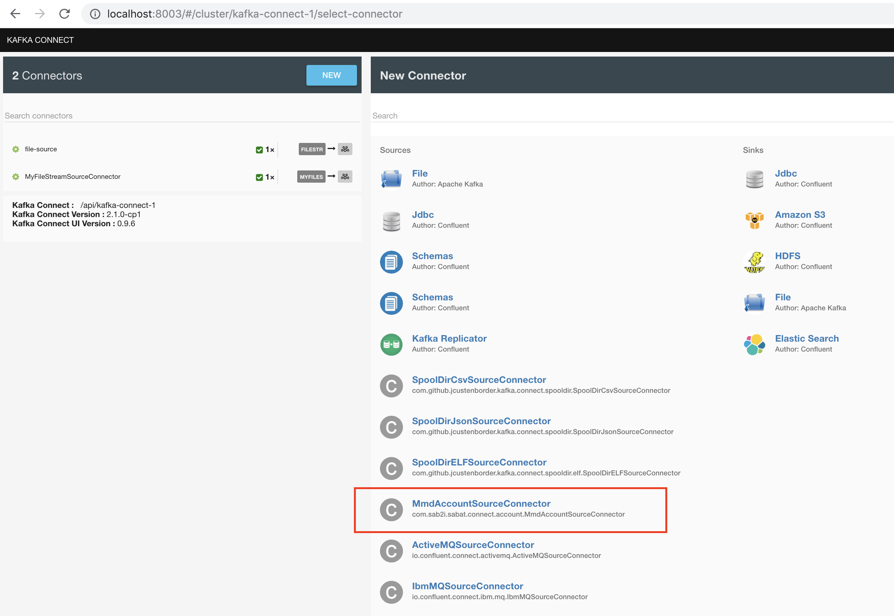
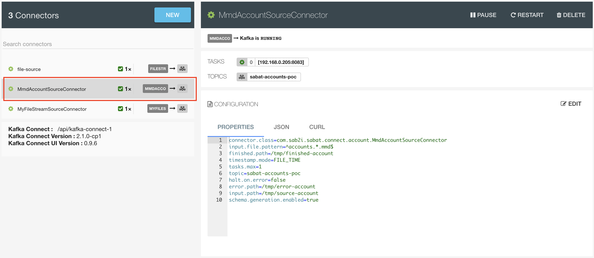
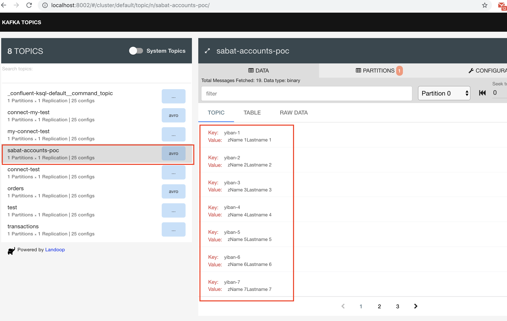

# Credits

This connector uses the excellent [kafka-connect-spooldir](https://github.com/jcustenborder/kafka-connect-spooldir) under the hood. 


# Overview

This POC Kafka Connect connector provides the capability to watch a directory for files and read the data as new files are
written to the input directory. Each of the records (line) in the input file will be converted and send to specified kafka topic. 

# Configuration

The task class `MmdAccountSourceTask.java` should be modified to parse MMD flux and write internal connect schema, that is automatically translated to AVRO by confluent avro converter. 
The main method to adapt is `MmdAccountSourceTask.process()`.


This POC parses the file line by splitting it by "|" character:
* split[0] - key
* split[1] - value field `firstname`
* split[2] - value field `lastname`

# Building on you workstation

```
git clone git@github.com:dimapod/kafka-connect-mmd.git
cd kafka-connect-mmd
mvn clean package
```

# Landoop UIs

We recommend to use Landoop UIs to simply inspect your Kafka topics, Connectors and Registy :

* kafka-topics-ui: See this [github repository](https://github.com/Landoop/kafka-topics-ui) to how to launch it in docker 
* kafka-connect-ui: See this [github repository](https://github.com/Landoop/kafka-connect-ui) to how to launch it in docker 
* schema-registry-ui: See this [github repository](https://github.com/Landoop/schema-registry-ui) to how to launch it in docker 

# Installing

The MMD POC connector can be installed as any standard kafka connector.

For example:

**Start confluent platform**
* Go to confluent installation directory
* `./bin/confluent start`  - start the full confluent platform
* `./bin/confluent status` - verify it is working
* `./bin/confluent stop connect && ./bin/confluent start connect` - restart connect (after placing new connector for ex)
* `./bin/confluent log connect` - kafka connect logs
 
**Install mmd connector**
* By default kafka connect scans for connectors in `./share/java`  
* For simplicity you can create a symlinc in this directory pointing to your connector build: 
   `ln -s <path to cloned directory>/kafka-connect-mmd/target/kafka-connect-mmd ./share/java/kafka-connect-mmd`
* Alternatively you can just copy directory `<path to cloned directory>/kafka-connect-mmd/target/kafka-connect-mmd` to `./share/java`
* Restart kafka connect: `./bin/confluent stop connect && ./bin/confluent start connect`
* Verify that connector is detected in kafka-connect-ui:


**Create new connector instance**
* First of all create 3 dirs (`source-account` for files to be integrated, `finished-account` - for finished files, `error-account` - for rejected files)
```
mkdir /tmp/source-account
mkdir /tmp/finished-account
mkdir /tmp/error-account
```
* in kafka-connect-ui
* click `New` -> `MmdAccountSourceConnector`
* Fill in the following properties:
```
name=MmdAccountSourceConnector
connector.class=com.sab2i.sabat.connect.account.MmdAccountSourceConnector
input.file.pattern=^accounts.*.mmd$
finished.path=/tmp/finished-account
timestamp.mode=FILE_TIME
tasks.max=1
topic=sabat-accounts-poc
halt.on.error=false
error.path=/tmp/error-account
input.path=/tmp/source-account
schema.generation.enabled=true
```  
* Click `Create`

* Your new connector is now up and running

* It is possible to do the same with APIs:
```
curl -X POST \
  http://localhost:8083/connectors/ \
  -H 'Content-Type: application/json' \
  -H 'Accept: application/json' \
  -d '{
  "name": "MmdAccountSourceConnector",
  "config": {
    "connector.class": "com.sab2i.sabat.connect.account.MmdAccountSourceConnector",
    "input.file.pattern": "^accounts.*.mmd$",
    "finished.path": "/tmp/finished-account",
    "timestamp.mode": "FILE_TIME",
    "tasks.max": "1",
    "topic": "sabat-accounts-poc",
    "halt.on.error": "false",
    "error.path": "/tmp/error-account",
    "input.path": "/tmp/source-account",
    "schema.generation.enabled": "true"
  }
}'
```

# Test it
* Generate some test files
```
for i in {0..10}; do echo "iban-$i|Name $i|Lastname $i"; done >> accounts1.mmd
for i in {0..10}; do echo "iban-$i|Name $i|Lastname $i"; done >> accounts2.mmd
for i in {0..10}; do echo "iban-$i|Name $i|Lastname $i"; done >> accounts3.mmd
```
* Move them to /tmp/source-account: `mv accounts*.mmd /tmp/source-account`
* Verify that the /tmp/source-account is empty (file has beed integrated and placed in /tmp/finished-account)
* Using kafka-topics-ui verify the messages in `sabat-accounts-poc` topic

